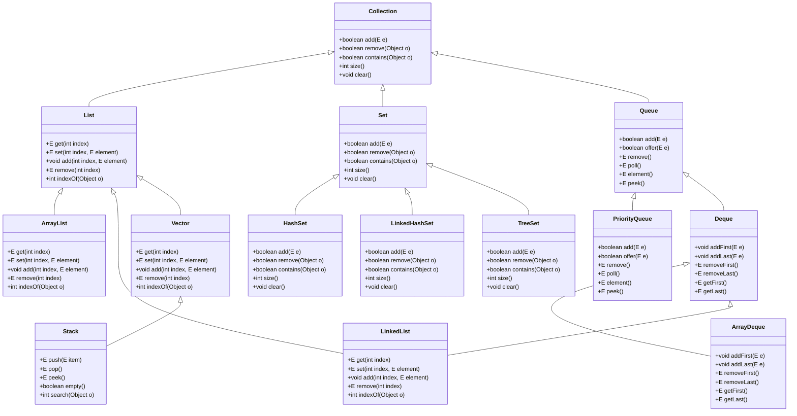

Sure! Here's a list of some key Java collection interfaces and classes, along with a Mermaid graph for the class diagram:

### Key Interfaces and Classes:
- **Collection Interface**: The root interface for all collection classes.
  - **List Interface**: An ordered collection (also known as a sequence).
    - **ArrayList**: A resizable array implementation of the List interface.
    - **LinkedList**: A doubly-linked list implementation of the List interface.
    - **Vector**: A synchronized, resizable array implementation of the List interface.
      - **Stack**: A last-in-first-out (LIFO) stack of objects.
  - **Set Interface**: A collection that does not allow duplicate elements.
    - **HashSet**: A hash table-based implementation of the Set interface.
    - **LinkedHashSet**: A hash table and linked list implementation of the Set interface, with predictable iteration order.
    - **TreeSet**: A NavigableSet implementation based on a TreeMap.
  - **Queue Interface**: A collection used to hold multiple elements prior to processing.
    - **PriorityQueue**: A priority heap-based implementation of the Queue interface.
    - **Deque Interface**: A double-ended queue that supports element insertion and removal at both ends.
      - **ArrayDeque**: A resizable array implementation of the Deque interface.
      - **LinkedList**: Also implements the Deque interface.

### Mermaid Graph for Class Diagram:


### Hashset vs Treeset

| **Feature**              | **HashSet**                                      | **TreeSet**                                      |
|--------------------------|--------------------------------------------------|--------------------------------------------------|
| **Underlying Data Structure** | Hash table                                    | Red-Black tree                                   |
| **Ordering**             | Unordered, elements are not stored in any particular order | Ordered, elements are stored in natural order or by a custom comparator |
| **Performance**          | O(1) average time complexity for add, remove, and contains operations | O(log n) time complexity for add, remove, and contains operations |
| **Null Elements**        | Allows one null element                          | Does not allow null elements                     |
| **Duplicates**           | Does not allow duplicates                        | Does not allow duplicates                        |
| **Use Case**             | Suitable for scenarios where fast access and no ordering are required | Suitable for scenarios where sorted order is required |
| **Memory Overhead**      | Lower memory overhead compared to `TreeSet`      | Higher memory overhead due to tree structure     |
| **Iteration Order**      | Unpredictable iteration order                    | Predictable iteration order                      |
| **Comparator Support**   | Does not support custom comparators              | Supports custom comparators                      |

### When to Use Which?
- **HashSet**: Use `HashSet` when you need a collection that provides fast access, insertion, and deletion without any specific order. It's ideal for scenarios where you need to ensure uniqueness but don't care about the order of elements.
- **TreeSet**: Use `TreeSet` when you need a sorted set of elements. It's useful for scenarios where you need to maintain a natural order or a custom order defined by a comparator.

### Example Usage:
#### HashSet:
```java
HashSet<String> hashSet = new HashSet<>();
hashSet.add("Banana");
hashSet.add("Apple");
hashSet.add("Orange");

System.out.println(hashSet); // Output: [Banana, Apple, Orange] (order may vary)
```

#### TreeSet:
```java
TreeSet<String> treeSet = new TreeSet<>();
treeSet.add("Banana");
treeSet.add("Apple");
treeSet.add("Orange");

System.out.println(treeSet); // Output: [Apple, Banana, Orange] (sorted order)
```

Let's compare `HashMap` and `ConcurrentHashMap`, two commonly used implementations of the `Map` interface in Java:

| **Feature**              | **HashMap**                                      | **ConcurrentHashMap**                                      |
|--------------------------|--------------------------------------------------|------------------------------------------------------------|
| **Thread Safety**        | Not thread-safe                                  | Thread-safe                                                |
| **Concurrency**          | Suitable for single-threaded or low-concurrency environments | Suitable for high-concurrency environments                  |
| **Performance**          | High performance in single-threaded scenarios    | High performance in multi-threaded scenarios                |
| **Locking Mechanism**    | No locking mechanism                             | Uses a segmented locking mechanism to allow concurrent access |
| **Null Values**          | Allows one null key and multiple null values     | Does not allow null keys or values                          |
| **Iteration**            | Fail-fast iterator (throws `ConcurrentModificationException` if modified during iteration) | Weakly consistent iterator (does not throw `ConcurrentModificationException`) |
| **Use Case**             | Suitable for scenarios where thread safety is not a concern | Suitable for scenarios where thread safety and high concurrency are required |
| **Memory Overhead**      | Lower memory overhead                            | Higher memory overhead due to additional concurrency control mechanisms |

### When to Use Which?
- **HashMap**: Use `HashMap` when you need a simple, high-performance map for single-threaded or low-concurrency scenarios. It's ideal for cases where thread safety is not a concern.
- **ConcurrentHashMap**: Use `ConcurrentHashMap` when you need a thread-safe map for high-concurrency scenarios. It's designed to handle concurrent access efficiently, making it suitable for multi-threaded applications.

### Example Usage:
#### HashMap:
```java
HashMap<String, Integer> hashMap = new HashMap<>();
hashMap.put("Apple", 1);
hashMap.put("Banana", 2);
hashMap.put("Orange", 3);

System.out.println(hashMap); // Output: {Apple=1, Banana=2, Orange=3}
```

#### ConcurrentHashMap:
```java
ConcurrentHashMap<String, Integer> concurrentHashMap = new ConcurrentHashMap<>();
concurrentHashMap.put("Apple", 1);
concurrentHashMap.put("Banana", 2);
concurrentHashMap.put("Orange", 3);

System.out.println(concurrentHashMap); // Output: {Apple=1, Banana=2, Orange=3}
```

### Key Differences:
- **Thread Safety**: `HashMap` is not thread-safe, while `ConcurrentHashMap` is designed for concurrent access.
- **Locking Mechanism**: `ConcurrentHashMap` uses a segmented locking mechanism, allowing multiple threads to read and write concurrently without blocking each other.
- **Null Values**: `HashMap` allows null keys and values, whereas `ConcurrentHashMap` does not.
