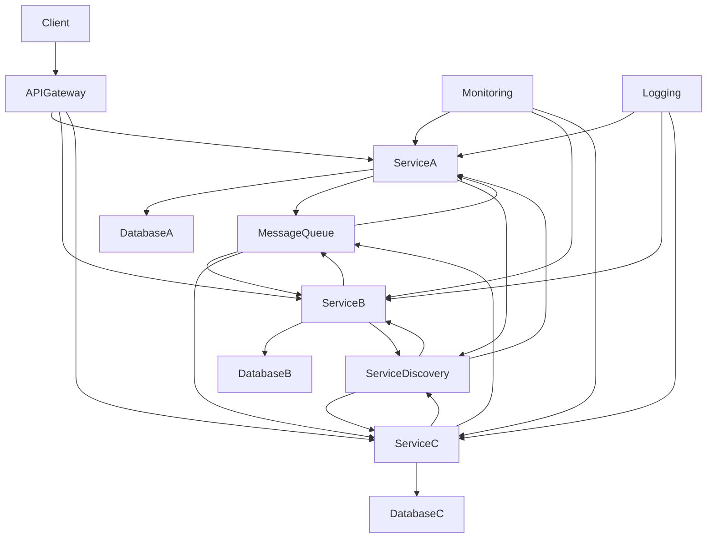

## distributed architecture

Handling a distributed architecture involves managing multiple interconnected systems that work together to achieve a common goal. Here are some key considerations and best practices for handling distributed architecture:

### Key Considerations:
1. **Scalability**: Ensure that the system can handle increased load by adding more resources.
2. **Reliability**: Design the system to be fault-tolerant and resilient to failures.
3. **Consistency**: Maintain data consistency across distributed components.
4. **Latency**: Minimize the time it takes for data to travel between components.
5. **Security**: Protect data and communication between components from unauthorized access.

### Best Practices:
1. **Microservices Architecture**: Break down the application into smaller, independent services that can be developed, deployed, and scaled independently.
2. **API Gateway**: Use an API gateway to manage and route requests to the appropriate microservices.
3. **Service Discovery**: Implement service discovery to dynamically locate services in the distributed system.
4. **Load Balancing**: Distribute incoming requests across multiple instances of a service to ensure even load distribution.
5. **Data Replication**: Replicate data across multiple nodes to ensure high availability and fault tolerance.
6. **Message Queues**: Use message queues to decouple services and enable asynchronous communication.
7. **Monitoring and Logging**: Implement monitoring and logging to track the health and performance of the system.
8. **Distributed Tracing**: Use distributed tracing to track requests as they flow through the system and identify bottlenecks.
9. **Circuit Breaker Pattern**: Implement the circuit breaker pattern to prevent cascading failures by stopping requests to a failing service.
10. **Configuration Management**: Use centralized configuration management to manage configuration settings across distributed components.

### Example Technologies:
- **Microservices Frameworks**: Spring Boot, Micronaut, Quarkus
- **API Gateway**: Netflix Zuul, Kong, AWS API Gateway
- **Service Discovery**: Netflix Eureka, Consul, Kubernetes
- **Load Balancing**: NGINX, HAProxy, AWS Elastic Load Balancing
- **Message Queues**: RabbitMQ, Apache Kafka, AWS SQS
- **Monitoring and Logging**: Prometheus, Grafana, ELK Stack (Elasticsearch, Logstash, Kibana)
- **Distributed Tracing**: Jaeger, Zipkin
- **Configuration Management**: Spring Cloud Config, Consul, etcd

### Example Architecture:
Here's a high-level overview of a distributed architecture using microservices:

### Summary:
- **Scalability**: Design for horizontal scaling.
- **Reliability**: Implement fault tolerance and resilience.
- **Consistency**: Ensure data consistency across components.
- **Latency**: Minimize communication delays.
- **Security**: Protect data and communication.
