### CAP Theorem

The CAP Theorem, also known as Brewer's Theorem, is a fundamental principle in distributed computing that states it is impossible for a distributed data store to simultaneously provide more than two out of the following three guarantees:

1. **Consistency (C):** Every read receives the most recent write or an error.
2. **Availability (A):** Every request receives a (non-error) response, without guarantee that it contains the most recent write.
3. **Partition Tolerance (P):** The system continues to operate despite an arbitrary number of messages being dropped (or delayed) by the network between nodes.

### Explanation

- **Consistency:** This ensures that all nodes see the same data at the same time. A system is consistent if a read is guaranteed to return the most recent write for a given piece of data.
- **Availability:** This ensures that every request (read or write) receives a response, regardless of the individual state of any node in the system.
- **Partition Tolerance:** This means the system continues to function even if network partitions (communication breakdowns between nodes) occur.

### Diagram

Here's a visual representation of the CAP Theorem:

```mermaid
graph TD
    CAP((CAP Theorem))
    CAP --- Consistency
    CAP --- Availability
    CAP --- PartitionTolerance
    
    subgraph CAP
        Consistency(C)
        Availability(A)
        PartitionTolerance(P)
    end
    
    classDef green fill:#9fdf9f,stroke:#333,stroke-width:2px;
    Consistency:::green
    Availability:::green
    PartitionTolerance:::green

    classDef faded fill:#ccc,stroke:#333,stroke-width:2px;
    
    Consistency -- Unable to Achieve All Three ---> Availability:::faded
    Consistency -- Unable to Achieve All Three ---> PartitionTolerance:::faded
    Availability -- Unable to Achieve All Three ---> Consistency:::faded
    Availability -- Unable to Achieve All Three ---> PartitionTolerance:::faded
    PartitionTolerance -- Unable to Achieve All Three ---> Consistency:::faded
    PartitionTolerance -- Unable to Achieve All Three ---> Availability:::faded
```

### Key Takeaways

- **Consistency and Availability:** If a system opts for consistency and availability, it cannot tolerate partitions. This means if there is a partition, the system may become unavailable to ensure consistency.
- **Consistency and Partition Tolerance:** If a system opts for consistency and partition tolerance, it may have to sacrifice availability. This means during a partition, some parts of the system may not be able to handle requests to ensure consistency.
- **Availability and Partition Tolerance:** If a system opts for availability and partition tolerance, it cannot guarantee consistency. This means during a partition, the system will continue to operate and respond to requests, but it may not provide the most recent data.

### Example Scenarios

- **CP (Consistency and Partition Tolerance):** Systems like HBase, MongoDB (in default configuration), and Redis (in clustered mode) prioritize consistency and partition tolerance over availability.
- **CA (Consistency and Availability):** Relational database systems like traditional SQL databases often prioritize consistency and availability, but they are not designed to handle partitions effectively.
- **AP (Availability and Partition Tolerance):** Systems like Cassandra and DynamoDB prioritize availability and partition tolerance over consistency.

