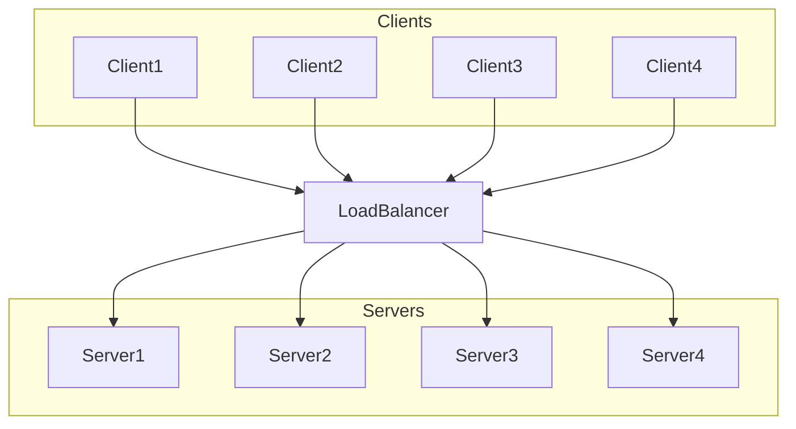

# load balancer

A load balancer is a system or device that distributes incoming network traffic across multiple servers to ensure no single server becomes overwhelmed, thereby optimizing the use of resources, maximizing throughput, minimizing response time, and avoiding overload. It acts as a reverse proxy, distributing client requests or network load efficiently across multiple servers.

## Key Functions of a Load Balancer

1. **Distributes Traffic:**
   - Balances incoming requests among a pool of servers, ensuring even distribution.
   
2. **Increases Availability and Reliability:**
   - By distributing the workload, load balancers help maintain the availability and reliability of applications. If a server fails, the load balancer redirects traffic to the remaining operational servers.
   
3. **Enhances Performance:**
   - By preventing any single server from becoming a bottleneck, load balancers help maintain consistent performance, especially during peak traffic times.
   
4. **Scalability:**
   - Allows for easier horizontal scaling by adding more servers to the pool without disrupting the existing infrastructure.

5. **Health Monitoring:**
   - Regularly checks the health of servers to ensure they can handle requests. If a server is unhealthy, the load balancer will temporarily remove it from the rotation.

## Types of Load Balancers

| **Type of Load Balancer** | **Description**                                                                 | **Use Case**                                                                 |
|---------------------------|---------------------------------------------------------------------------------|------------------------------------------------------------------------------|
| **Application Load Balancer (ALB)** | Operates at the application layer (Layer 7) of the OSI model. It can route traffic based on content, such as HTTP headers, cookies, and request paths. | Ideal for modern web applications and microservices architectures that require advanced routing capabilities. |
| **Network Load Balancer (NLB)** | Operates at the transport layer (Layer 4) of the OSI model. It is designed for high-performance load balancing of TCP and UDP traffic. | Suitable for applications that require ultra-low latency and high throughput, such as gaming, media streaming, and financial transactions. |
| **Classic Load Balancer (CLB)** | Provides basic load balancing across multiple EC2 instances. It supports Layer 4 and Layer 7 load balancing. | Used for simple load balancing needs, such as distributing traffic across multiple servers for web applications. |
| **Gateway Load Balancer (GWLB)** | Operates at the network layer (Layer 3) and is designed for load balancing of traffic to third-party virtual appliances. | Useful for applications that require load balancing of traffic to firewalls, intrusion detection systems, and other network appliances. |
| **Software Load Balancer** | Software-based solutions that run on servers or virtual machines. Examples include HAProxy, NGINX, and Apache. | Suitable for environments where flexibility and customization are needed, such as on-premises data centers or cloud environments. |
| **Hardware Load Balancer** | Dedicated appliances designed specifically for load balancing. | Ideal for high-availability environments that require robust hardware solutions for load balancing. |
| **Cloud-based Load Balancer** | Managed load-balancing services offered by cloud providers like AWS, Azure, and Google Cloud. | Great for cloud-native applications that need scalable and managed load balancing solutions. |

## Load balancing Strategies
### 1. Round Robin
**Description:**
Round Robin load balancing distributes client requests sequentially across a pool of servers. Each incoming request is sent to the next server in the list.

**Use Case:**
- Ideal for situations where servers have similar capabilities and handle similar amounts of work.
- Simple and effective for evenly distributing load in a homogeneous environment.

### 2. Weighted Round Robin
**Description:**
Weighted Round Robin assigns a weight to each server based on its capacity or performance. Servers with higher weights receive more requests than those with lower weights.

**Use Case:**
- Suitable for environments where servers have different capacities and performance levels.
- Ensures that more powerful servers handle more traffic, optimizing resource usage.

### 3. Least Connections
**Description:**
Least Connections strategy directs incoming requests to the server with the fewest active connections. This helps to balance the load more evenly across servers.

**Use Case:**
- Useful in environments where the duration of connections varies significantly.
- Helps to prevent overloading servers with long-running connections.

### 4. Weighted Least Connections
**Description:**
Weighted Least Connections considers both the number of active connections and the capacity of the servers. Requests are directed to the server with the fewest connections relative to its weight.

**Use Case:**
- Suitable for environments with servers of different capacities and varying connection durations.
- Ensures optimal load distribution based on server capacity and connection load.

### 5. Least Response Time
**Description:**
Least Response Time strategy sends requests to the server with the lowest average response time. This helps to reduce overall latency and improve user experience.

**Use Case:**
- Ideal for environments where response time is a critical performance metric.
- Helps to direct traffic to the fastest servers, ensuring quick responses.

### 6. Source IP Hash
**Description:**
Source IP Hash uses a hash function to determine which server should handle a request based on the client's IP address. This ensures that requests from the same client are consistently routed to the same server.

**Use Case:**
- Suitable for scenarios where session persistence is required.
- Ensures that a user's session remains on the same server, which is important for applications with session data stored locally on the server.

### 7. URL Hash
**Description:**
URL Hash distributes requests based on the URL content, such as the path or query string. This ensures that similar requests are routed to the same server.

**Use Case:**
- Ideal for applications that serve content based on URL parameters.
- Ensures consistency and caching efficiency for similar requests.

### 8. Random
**Description:**
Random load balancing strategy selects a server at random to handle each incoming request. This approach can be effective in evenly distributing traffic.

**Use Case:**
- Suitable for simple environments where a random distribution can achieve balance.
- Effective when combined with health checks to avoid routing to unhealthy servers.

### 9. Least Bandwidth
**Description:**
Least Bandwidth strategy directs traffic to the server currently serving the least amount of traffic measured in bytes per second.

**Use Case:**
- Useful in scenarios where bandwidth usage needs to be balanced.
- Helps prevent overloading any single server in terms of data throughput.

### 10. Geolocation-based Routing
**Description:**
Geolocation-based routing directs user requests to the nearest server based on the user's geographical location. This minimizes latency and improves the user experience.

**Use Case:**
- Ideal for globally distributed applications that need to provide fast responses to users worldwide.
- Ensures that users are directed to the closest server, reducing latency.

