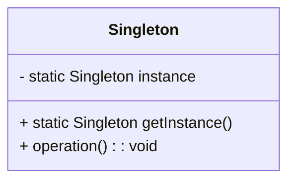
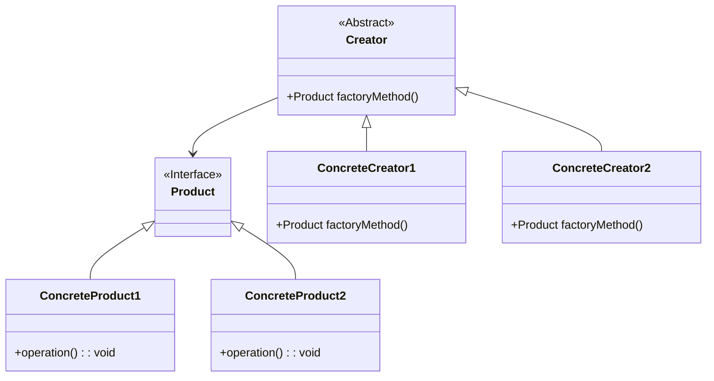
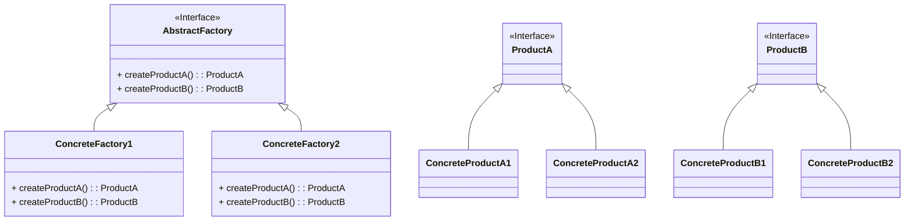
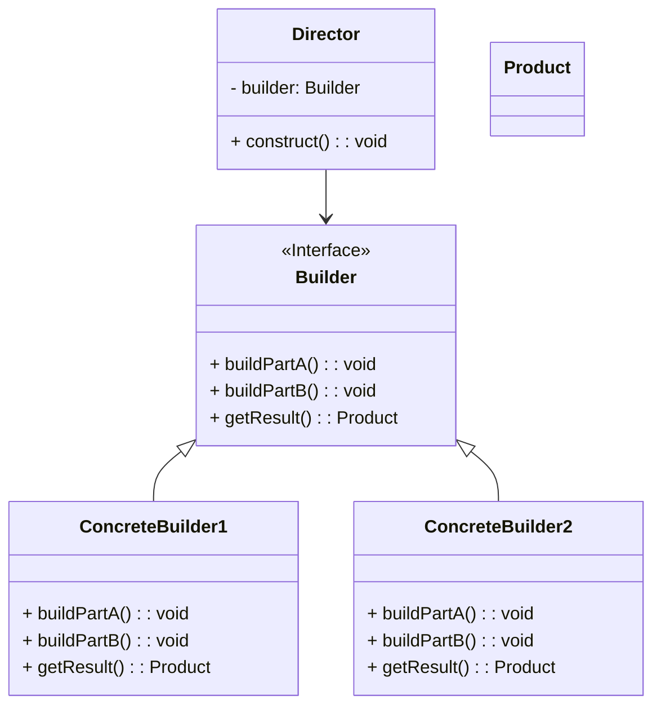
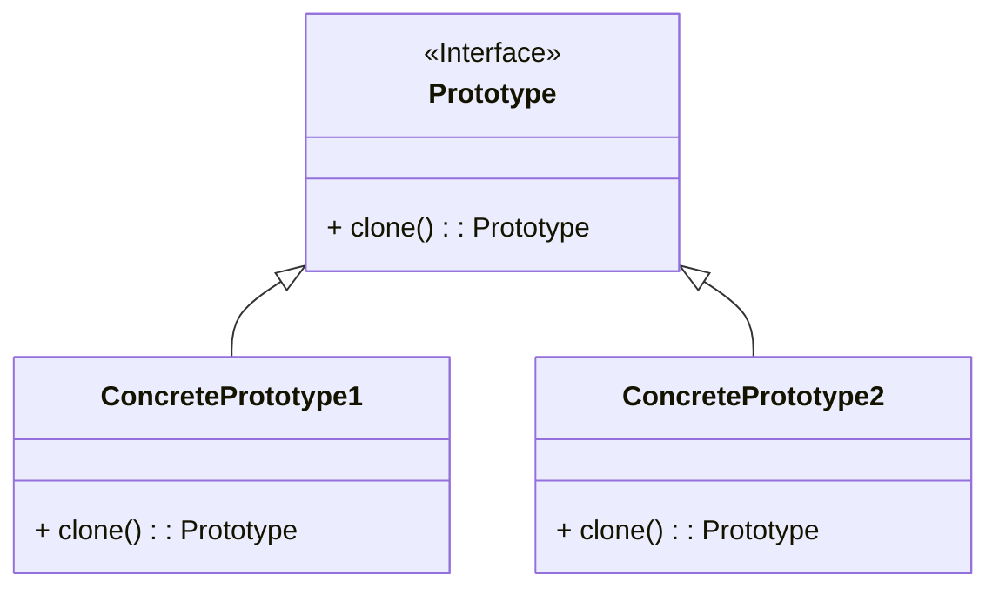

## Singleton Pattern

The Singleton Pattern ensures that a class has only one instance and provides a global point of access to it. This pattern is used when exactly one object is needed to coordinate actions across the system. It’s particularly useful when managing resources that are shared across an application, such as configuration settings, logging, or connection pools.

Here's the Mermaid diagram for the Singleton pattern:



### Explanation

- **Singleton Class:**
  - **`instance`:** A static member that holds the single instance of the Singleton class.
  - **`getInstance()`:** A static method that returns the single instance of the class. If the instance does not already exist, it is created.
  - **`operation()`:** An example method that the Singleton instance can perform.

### Benefits of the Singleton Pattern:
1. **Controlled Access to the Single Instance:** The Singleton class encapsulates its only instance, providing controlled access to it.
2. **Reduced Global State:** It avoids using global variables to store singleton instances.
3. **Lazy Initialization:** The Singleton instance is created only when it is needed for the first time.

### Implementation Example in Java

Here's a simple implementation example of the Singleton pattern in Java:

```java
public class Singleton {
    private static Singleton instance;

    private Singleton() {
        // Private constructor to prevent instantiation
    }

    public static Singleton getInstance() {
        if (instance == null) {
            instance = new Singleton();
        }
        return instance;
    }

    public void operation() {
        // Example method
        System.out.println("Singleton operation");
    }
}

// Usage
public class Main {
    public static void main(String[] args) {
        Singleton singleton = Singleton.getInstance();
        singleton.operation();
    }
}
```

In this example, the `Singleton` class ensures that only one instance of itself is created and provides a global point of access through the `getInstance` method. The constructor is private to prevent direct instantiation.


## Factory Method Pattern

The Factory Method Pattern is a creational design pattern that provides an interface for creating objects in a superclass but allows subclasses to alter the type of objects that will be created. This pattern is particularly useful when a class cannot anticipate the class of objects it needs to create, or when the responsibility of object creation needs to be delegated to subclasses.

Here's the Mermaid diagram for the Factory Method pattern:



### Explanation

- **Product Interface:** Declares the interface for objects that the factory method creates.
- **ConcreteProduct1 and ConcreteProduct2:** Implement the `Product` interface.
- **Creator Abstract Class:** Declares the factory method, which returns an object of type `Product`. Subclasses implement this method to create different types of products.
- **ConcreteCreator1 and ConcreteCreator2:** Implement the factory method to create instances of `ConcreteProduct1` and `ConcreteProduct2`, respectively.

### Benefits of the Factory Method Pattern:
1. **Flexibility:** Allows a class to defer instantiation to subclasses, enabling flexibility in object creation.
2. **Loose Coupling:** Decouples the client code from the concrete classes of products, promoting loose coupling.
3. **Scalability:** Easy to add new product types without changing existing client code, making the system scalable.

### Implementation Example in Java

Here's a simple implementation example of the Factory Method pattern in Java:

```java
// Product interface
interface Product {
    void operation();
}

// ConcreteProduct1 class
class ConcreteProduct1 implements Product {
    public void operation() {
        System.out.println("ConcreteProduct1 operation");
    }
}

// ConcreteProduct2 class
class ConcreteProduct2 implements Product {
    public void operation() {
        System.out.println("ConcreteProduct2 operation");
    }
}

// Creator abstract class
abstract class Creator {
    public abstract Product factoryMethod();
}

// ConcreteCreator1 class
class ConcreteCreator1 extends Creator {
    public Product factoryMethod() {
        return new ConcreteProduct1();
    }
}

// ConcreteCreator2 class
class ConcreteCreator2 extends Creator {
    public Product factoryMethod() {
        return new ConcreteProduct2();
    }
}

// Client code
public class Main {
    public static void main(String[] args) {
        Creator creator1 = new ConcreteCreator1();
        Product product1 = creator1.factoryMethod();
        product1.operation();

        Creator creator2 = new ConcreteCreator2();
        Product product2 = creator2.factoryMethod();
        product2.operation();
    }
}
```

In this example, the `Creator` class defines the `factoryMethod`, which is implemented by `ConcreteCreator1` and `ConcreteCreator2` to create instances of `ConcreteProduct1` and `ConcreteProduct2`, respectively. The client code uses the factory method to get the product instances without knowing their concrete classes.


## Abstract Factory Pattern

The Abstract Factory Pattern is a creational design pattern that provides an interface for creating families of related or dependent objects without specifying their concrete classes. It allows you to create objects that follow a general pattern and encapsulate a group of individual factories that have a common theme. This pattern is particularly useful when a system must be independent of how its objects are created, composed, and represented.

Here's the Mermaid diagram for the Abstract Factory pattern:



### Explanation

- **AbstractFactory Interface:** Declares methods for creating abstract products, `ProductA` and `ProductB`.
- **ConcreteFactory1 and ConcreteFactory2:** Implement the `AbstractFactory` interface and create specific products.
- **ProductA and ProductB Interfaces:** Declare the interfaces for a family of products.
- **ConcreteProductA1, ConcreteProductA2, ConcreteProductB1, and ConcreteProductB2:** Implement the `ProductA` and `ProductB` interfaces.

### Benefits of the Abstract Factory Pattern:
1. **Encapsulation of Object Creation:** Groups object creation code in one place, making the code easier to manage.
2. **Consistency:** Ensures that related products are created together, maintaining consistency in the product family.
3. **Separation of Concerns:** Promotes separation of concerns by decoupling object creation from usage.
4. **Flexibility:** Makes it easy to change the families of related products, as the client code only depends on the abstract interfaces.

### Implementation Example in Java

Here's a simple implementation example of the Abstract Factory pattern in Java:

```java
// Abstract Factory interface
interface AbstractFactory {
    ProductA createProductA();
    ProductB createProductB();
}

// Concrete Factory 1
class ConcreteFactory1 implements AbstractFactory {
    public ProductA createProductA() {
        return new ConcreteProductA1();
    }
    public ProductB createProductB() {
        return new ConcreteProductB1();
    }
}

// Concrete Factory 2
class ConcreteFactory2 implements AbstractFactory {
    public ProductA createProductA() {
        return new ConcreteProductA2();
    }
    public ProductB createProductB() {
        return new ConcreteProductB2();
    }
}

// Product A interface
interface ProductA {
}

// Product B interface
interface ProductB {
}

// Concrete Product A1
class ConcreteProductA1 implements ProductA {
}

// Concrete Product A2
class ConcreteProductA2 implements ProductA {
}

// Concrete Product B1
class ConcreteProductB1 implements ProductB {
}

// Concrete Product B2
class ConcreteProductB2 implements ProductB {
}

// Client code
public class Main {
    public static void main(String[] args) {
        AbstractFactory factory1 = new ConcreteFactory1();
        ProductA productA1 = factory1.createProductA();
        ProductB productB1 = factory1.createProductB();

        AbstractFactory factory2 = new ConcreteFactory2();
        ProductA productA2 = factory2.createProductA();
        ProductB productB2 = factory2.createProductB();
    }
}
```

In this example, `ConcreteFactory1` and `ConcreteFactory2` implement the `AbstractFactory` interface to create specific products. The client code uses these factories to create products without knowing their concrete classes.


## Builder Pattern

The Builder Pattern is a creational design pattern that separates the construction of a complex object from its representation, allowing the same construction process to create different representations. This pattern is particularly useful when the creation process of an object is complicated, involves multiple steps, or requires different configurations.

Here's the Mermaid diagram for the Builder pattern:



### Explanation

- **Builder Interface:** Declares methods for building the different parts of a product (`buildPartA`, `buildPartB`) and a method to retrieve the product (`getResult`).
- **ConcreteBuilder1 and ConcreteBuilder2:** Implement the `Builder` interface to create specific parts of the product. Each builder can create a different representation of the product.
- **Director:** Uses the `Builder` interface to construct a product. The `construct` method directs the building process.
- **Product:** Represents the complex object that is being built.

### Benefits of the Builder Pattern:
1. **Controlled Construction:** Allows finer control over the construction process of complex objects.
2. **Separation of Concerns:** Separates the construction of an object from its representation, making the code more modular and maintainable.
3. **Reusability:** Reuse the same construction process to build different representations of objects.
4. **Flexibility:** Easier to add new types of products or builders without changing existing code.

### Implementation Example in Java

Here's a simple implementation example of the Builder pattern in Java:

```java
// Product class
class Product {
    private String partA;
    private String partB;

    public void setPartA(String partA) {
        this.partA = partA;
    }

    public void setPartB(String partB) {
        this.partB = partB;
    }

    public void showParts() {
        System.out.println("PartA: " + partA + ", PartB: " + partB);
    }
}

// Builder interface
interface Builder {
    void buildPartA();
    void buildPartB();
    Product getResult();
}

// ConcreteBuilder1 class
class ConcreteBuilder1 implements Builder {
    private Product product = new Product();

    public void buildPartA() {
        product.setPartA("PartA1");
    }

    public void buildPartB() {
        product.setPartB("PartB1");
    }

    public Product getResult() {
        return product;
    }
}

// ConcreteBuilder2 class
class ConcreteBuilder2 implements Builder {
    private Product product = new Product();

    public void buildPartA() {
        product.setPartA("PartA2");
    }

    public void buildPartB() {
        product.setPartB("PartB2");
    }

    public Product getResult() {
        return product;
    }
}

// Director class
class Director {
    private Builder builder;

    public void setBuilder(Builder builder) {
        this.builder = builder;
    }

    public void construct() {
        builder.buildPartA();
        builder.buildPartB();
    }
}

// Client code
public class Main {
    public static void main(String[] args) {
        Director director = new Director();

        Builder builder1 = new ConcreteBuilder1();
        director.setBuilder(builder1);
        director.construct();
        Product product1 = builder1.getResult();
        product1.showParts();

        Builder builder2 = new ConcreteBuilder2();
        director.setBuilder(builder2);
        director.construct();
        Product product2 = builder2.getResult();
        product2.showParts();
    }
}
```

In this example, `ConcreteBuilder1` and `ConcreteBuilder2` implement the `Builder` interface to create different representations of `Product`. The `Director` class guides the construction process, and the client code uses the director and builders to create and retrieve the products.


## Prototype Pattern

The Prototype Pattern is a creational design pattern that specifies the kinds of objects to create using a prototypical instance and creates new objects by copying this prototype. This pattern is particularly useful when creating new instances of a class is either costly or complex. Instead of creating new instances from scratch, you clone an existing instance.

Here's the Mermaid diagram for the Prototype pattern:



### Explanation

- **Prototype Interface:** Declares the `clone` method for copying the prototype.
- **ConcretePrototype1 and ConcretePrototype2:** Implement the `clone` method, allowing these classes to be cloned. Each concrete class provides its own implementation of the cloning mechanism.

### Benefits of the Prototype Pattern:
1. **Reduces the need for subclassing:** Cloning an existing object avoids the need to create subclasses of a base class.
2. **Speeds up the creation of objects:** Cloning is usually faster than instantiating a new object.
3. **Simplifies complex initialization:** The Prototype pattern can simplify the process of creating objects that require complex setup or initialization.

### Implementation Example in Java

Here's a simple implementation example of the Prototype pattern in Java:

```java
// Prototype interface
interface Prototype {
    Prototype clone();
}

// ConcretePrototype1 class
class ConcretePrototype1 implements Prototype {
    private String field;

    public ConcretePrototype1(String field) {
        this.field = field;
    }

    public Prototype clone() {
        return new ConcretePrototype1(this.field);
    }

    public String getField() {
        return field;
    }
}

// ConcretePrototype2 class
class ConcretePrototype2 implements Prototype {
    private int field;

    public ConcretePrototype2(int field) {
        this.field = field;
    }

    public Prototype clone() {
        return new ConcretePrototype2(this.field);
    }

    public int getField() {
        return field;
    }
}

// Client code
public class Main {
    public static void main(String[] args) {
        ConcretePrototype1 prototype1 = new ConcretePrototype1("Value1");
        ConcretePrototype1 clone1 = (ConcretePrototype1) prototype1.clone();
        System.out.println(clone1.getField());

        ConcretePrototype2 prototype2 = new ConcretePrototype2(42);
        ConcretePrototype2 clone2 = (ConcretePrototype2) prototype2.clone();
        System.out.println(clone2.getField());
    }
}
```

In this example, the `ConcretePrototype1` and `ConcretePrototype2` classes implement the `Prototype` interface to create clones of themselves. The client code creates and clones these prototypes, demonstrating how the Prototype pattern simplifies object creation.

