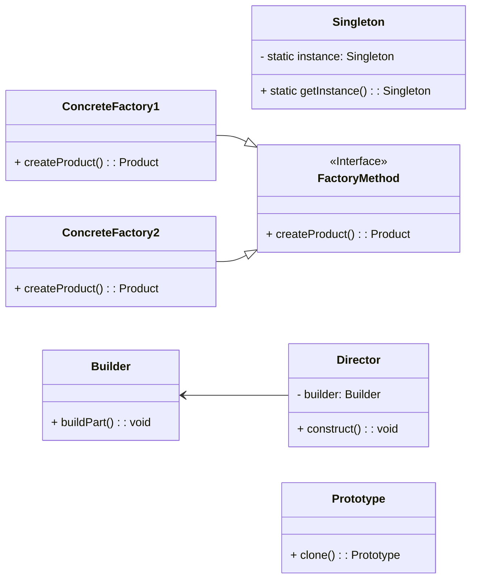
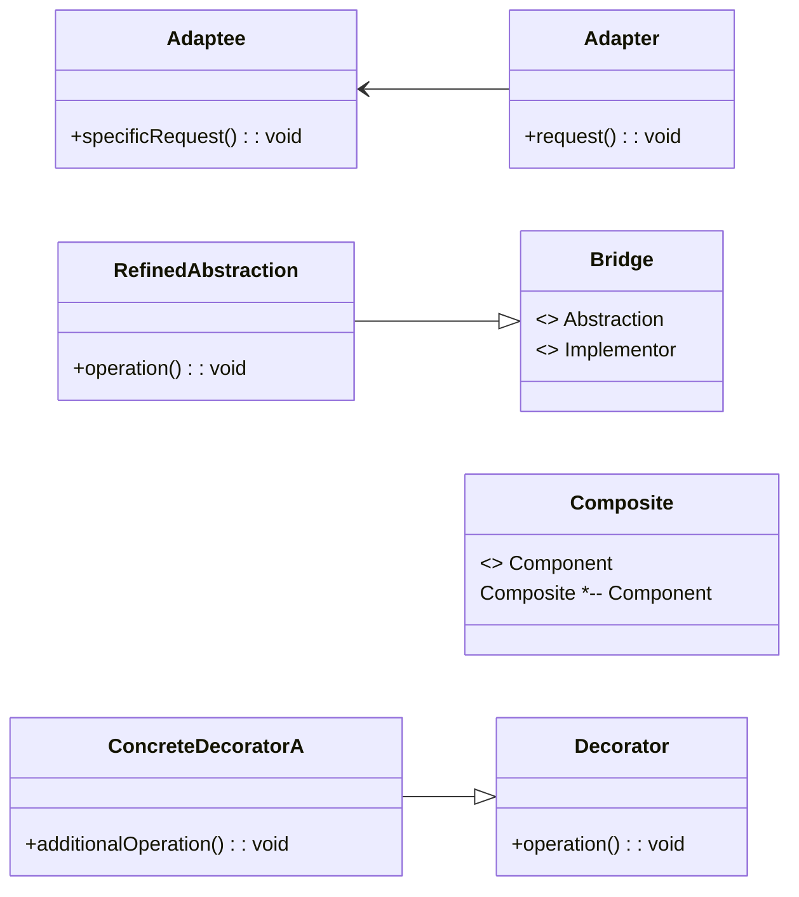
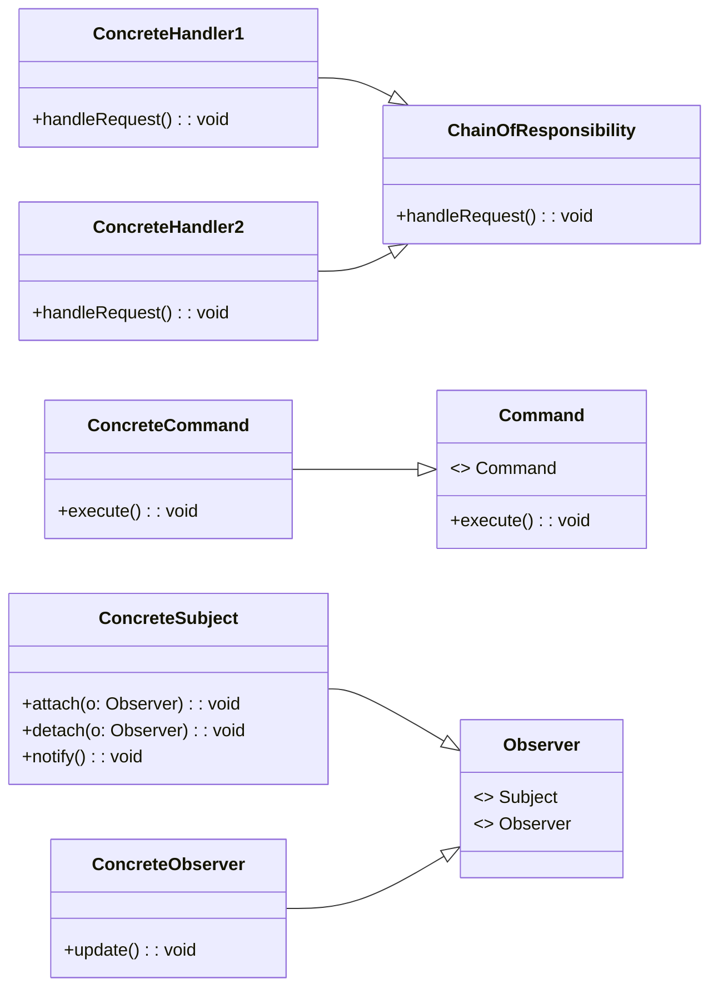

Certainly! Let's delve into the three main categories of design patterns in software engineering: Creational, Structural, and Behavioral patterns. I'll also include diagrams to illustrate each category.

### 1. Creational Patterns
Creational patterns deal with object creation mechanisms, trying to create objects in a manner suitable to the situation. Here are a few key creational patterns:

- **Singleton Pattern:** Ensures a class has only one instance and provides a global point of access to it.
- **Factory Method Pattern:** Defines an interface for creating an object but lets subclasses alter the type of objects that will be created.
- **Abstract Factory Pattern:** Provides an interface for creating families of related or dependent objects without specifying their concrete classes.
- **Builder Pattern:** Separates the construction of a complex object from its representation, allowing the same construction process to create different representations.
- **Prototype Pattern:** Specifies the kinds of objects to create using a prototypical instance, and creates new objects by copying this prototype.

### 2. Structural Patterns
Structural patterns deal with object composition or how the classes and objects are composed to form larger structures. Here are a few key structural patterns:

- **Adapter Pattern:** Allows incompatible interfaces to work together.
- **Bridge Pattern:** Separates an object’s interface from its implementation so that the two can vary independently.
- **Composite Pattern:** Composes objects into tree structures to represent part-whole hierarchies.
- **Decorator Pattern:** Adds additional responsibilities to an object dynamically.
- **Facade Pattern:** Provides a simplified interface to a complex subsystem.
- **Flyweight Pattern:** Uses sharing to support large numbers of fine-grained objects efficiently.
- **Proxy Pattern:** Provides a surrogate or placeholder for another object to control access to it.

### 3. Behavioral Patterns
Behavioral patterns are concerned with algorithms and the assignment of responsibilities between objects. Here are a few key behavioral patterns:

- **Chain of Responsibility Pattern:** Passes a request along a chain of handlers.
- **Command Pattern:** Encapsulates a request as an object, thereby allowing for parameterization and queuing of requests.
- **Iterator Pattern:** Provides a way to access the elements of an aggregate object sequentially without exposing its underlying representation.
- **Mediator Pattern:** Defines an object that encapsulates how a set of objects interact.
- **Memento Pattern:** Captures and restores an object’s internal state.
- **Observer Pattern:** Defines a one-to-many dependency between objects so that when one object changes state, all its dependents are notified and updated automatically.
- **Strategy Pattern:** Defines a family of algorithms, encapsulates each one, and makes them interchangeable.
- **Visitor Pattern:** Represents an operation to be performed on the elements of an object structure.

