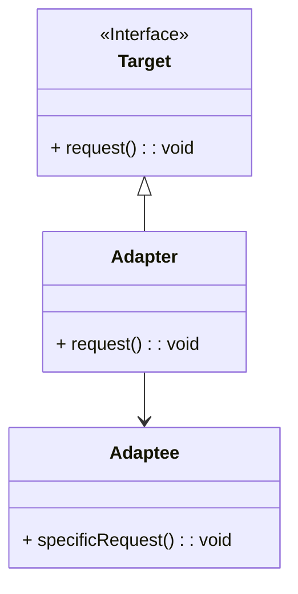
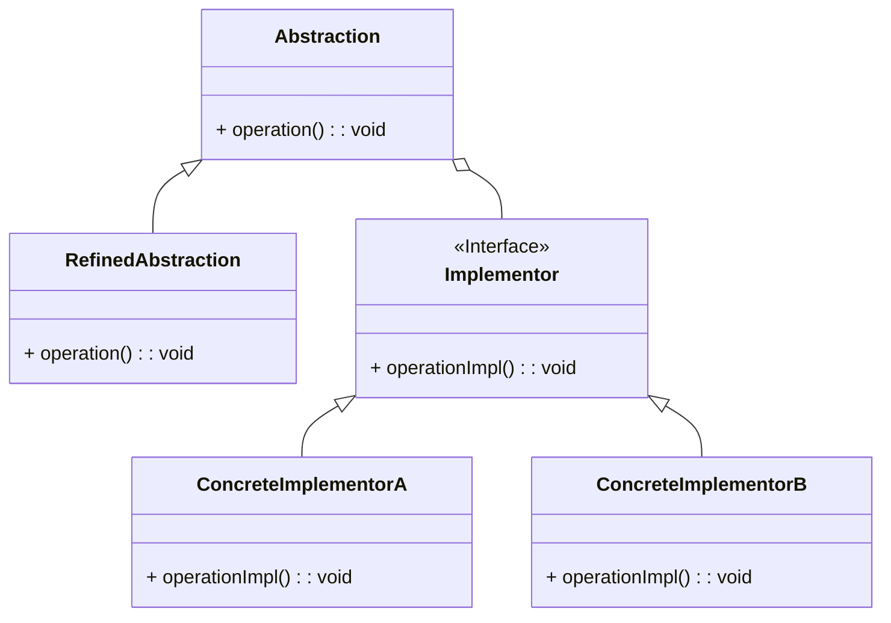
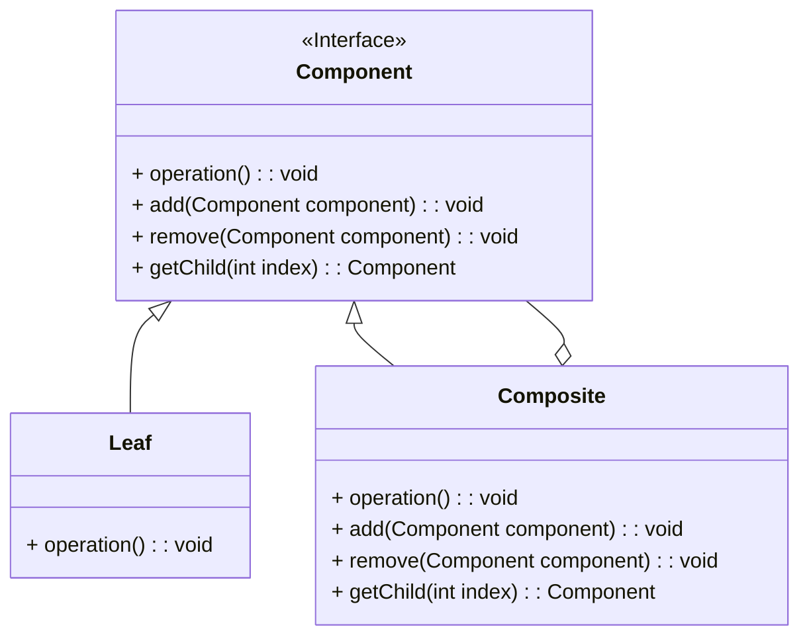
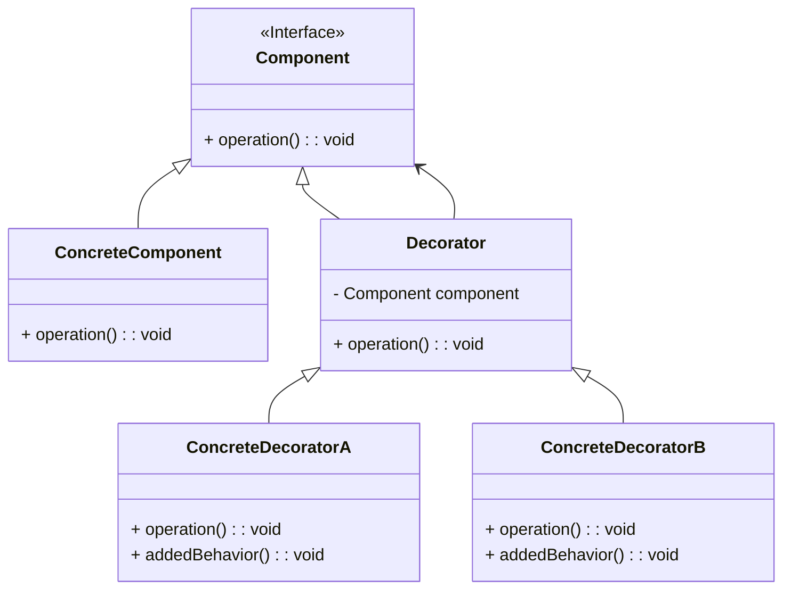
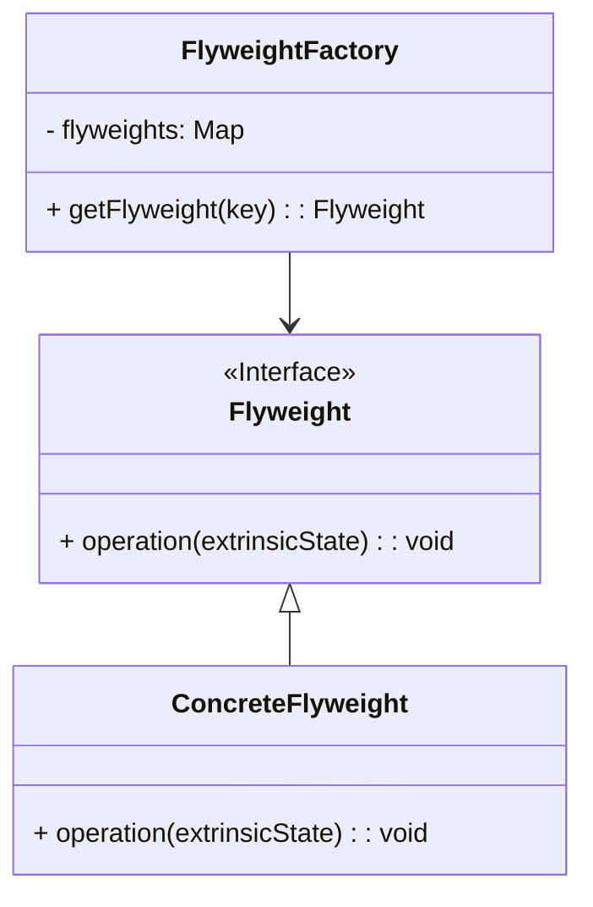
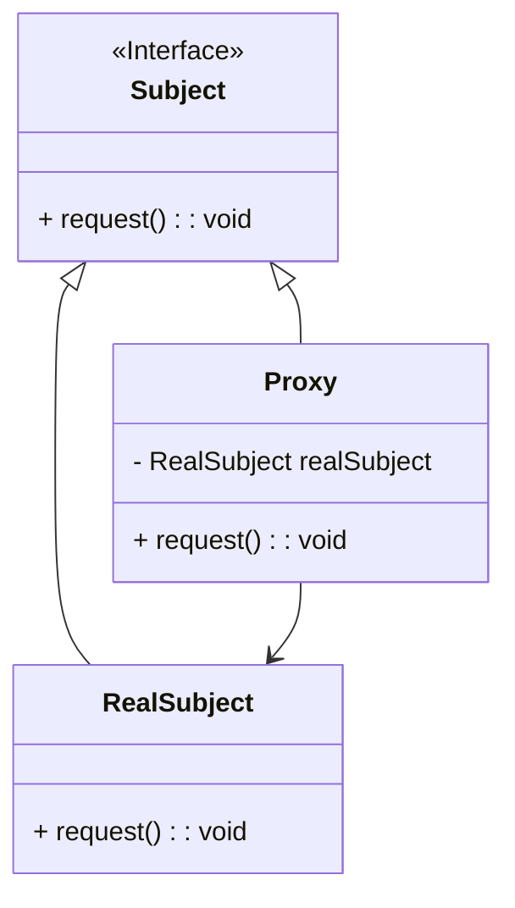

## Adapter Pattern

The Adapter Pattern is a structural design pattern that allows objects with incompatible interfaces to work together. It acts as a bridge between two incompatible interfaces by providing a way to convert one interface into another that a client expects. This pattern is particularly useful when integrating legacy systems with new systems, or when you want to use a class that has an incompatible interface.

Here's the Mermaid diagram for the Adapter pattern:



### Explanation

- **Target Interface:** Defines the domain-specific interface that the client uses.
- **Adaptee Class:** Contains some useful behavior but has an incompatible interface.
- **Adapter Class:** Implements the `Target` interface and translates the requests from the `Target` interface into calls to the `Adaptee` class.

### Benefits of the Adapter Pattern:
1. **Reusability:** Allows existing functionality to be reused where otherwise it would be incompatible.
2. **Decoupling:** Decouples the client code from the implementations of the `Adaptee` class.
3. **Flexibility:** Makes it easier to extend or replace functionalities without modifying existing code.

### Implementation Example in Java

Here's a simple implementation example of the Adapter pattern in Java:

```java
// Target interface
interface Target {
    void request();
}

// Adaptee class
class Adaptee {
    public void specificRequest() {
        System.out.println("Adaptee specific request");
    }
}

// Adapter class
class Adapter implements Target {
    private Adaptee adaptee;

    public Adapter(Adaptee adaptee) {
        this.adaptee = adaptee;
    }

    public void request() {
        adaptee.specificRequest();
    }
}

// Client code
public class Main {
    public static void main(String[] args) {
        Adaptee adaptee = new Adaptee();
        Target adapter = new Adapter(adaptee);
        adapter.request();
    }
}
```

In this example:
- The `Target` interface defines the method `request` that the client expects.
- The `Adaptee` class has a method `specificRequest` with different behavior.
- The `Adapter` class implements the `Target` interface and uses an instance of `Adaptee` to fulfill the request by calling `specificRequest`.

The client code creates an instance of `Adaptee` and an instance of `Adapter` that makes the `Adaptee` compatible with the `Target` interface.

## Bridge Pattern

The Bridge Pattern is a structural design pattern that separates the abstraction from its implementation, allowing them to vary independently. This pattern is particularly useful when you want to avoid a permanent binding between an abstraction and its implementation, or when both the abstraction and its implementation should be extensible by subclassing.

Here's the Mermaid diagram for the Bridge pattern:



### Explanation

- **Abstraction:** Defines the abstract interface and maintains a reference to an object of type `Implementor`.
- **RefinedAbstraction:** Extends the `Abstraction` and implements the `operation` method by using methods from `Implementor`.
- **Implementor Interface:** Declares the interface for implementation classes that provide concrete implementations.
- **ConcreteImplementorA and ConcreteImplementorB:** Implement the `Implementor` interface and provide specific implementations for the `operationImpl` method.

### Benefits of the Bridge Pattern:
1. **Decoupling Abstraction and Implementation:** Allows the abstraction and its implementation to vary independently.
2. **Improved Extensibility:** Makes it easier to extend the abstraction and the implementation independently.
3. **Enhanced Flexibility:** Reduces the need to modify code when adding new abstractions or implementations.

### Implementation Example in Java

Here's a simple implementation example of the Bridge pattern in Java:

```java
// Implementor interface
interface Implementor {
    void operationImpl();
}

// ConcreteImplementorA class
class ConcreteImplementorA implements Implementor {
    public void operationImpl() {
        System.out.println("ConcreteImplementorA operation");
    }
}

// ConcreteImplementorB class
class ConcreteImplementorB implements Implementor {
    public void operationImpl() {
        System.out.println("ConcreteImplementorB operation");
    }
}

// Abstraction class
abstract class Abstraction {
    protected Implementor implementor;

    protected Abstraction(Implementor implementor) {
        this.implementor = implementor;
    }

    public abstract void operation();
}

// RefinedAbstraction class
class RefinedAbstraction extends Abstraction {
    public RefinedAbstraction(Implementor implementor) {
        super(implementor);
    }

    public void operation() {
        implementor.operationImpl();
    }
}

// Client code
public class Main {
    public static void main(String[] args) {
        Implementor implementorA = new ConcreteImplementorA();
        Abstraction abstractionA = new RefinedAbstraction(implementorA);
        abstractionA.operation();

        Implementor implementorB = new ConcreteImplementorB();
        Abstraction abstractionB = new RefinedAbstraction(implementorB);
        abstractionB.operation();
    }
}
```

In this example:
- The `Implementor` interface defines the method `operationImpl` that concrete implementors will provide.
- `ConcreteImplementorA` and `ConcreteImplementorB` provide specific implementations of `operationImpl`.
- The `Abstraction` class maintains a reference to an `Implementor` and defines the abstract `operation` method.
- `RefinedAbstraction` extends `Abstraction` and implements the `operation` method by calling the `operationImpl` method of the `Implementor`.

The client code creates different combinations of abstractions and implementors, demonstrating how they can vary independently.

## Composite Pattern

The Composite Pattern is a structural design pattern that allows you to compose objects into tree structures to represent part-whole hierarchies. This pattern lets clients treat individual objects and compositions of objects uniformly. It is particularly useful when dealing with tree-like structures such as file systems, organizational hierarchies, or UI components.

Here's the Mermaid diagram for the Composite pattern:



### Explanation

- **Component Interface:** Declares common operations for both `Leaf` and `Composite` objects, such as `operation`, `add`, `remove`, and `getChild`.
- **Leaf Class:** Represents individual objects in the composition. Implements the `Component` interface but does not support adding or removing components.
- **Composite Class:** Represents a composite component that can have children. Implements the `Component` interface and defines behavior for adding, removing, and accessing child components.

### Benefits of the Composite Pattern:
1. **Uniformity:** Treats individual objects and compositions of objects uniformly.
2. **Flexibility:** Makes it easy to add new kinds of components without changing existing code.
3. **Simplified Client Code:** Clients can interact with complex tree structures through a simple interface.

### Implementation Example in Java

Here's a simple implementation example of the Composite pattern in Java:

```java
// Component interface
interface Component {
    void operation();
    default void add(Component component) {
        throw new UnsupportedOperationException();
    }
    default void remove(Component component) {
        throw new UnsupportedOperationException();
    }
    default Component getChild(int index) {
        throw new UnsupportedOperationException();
    }
}

// Leaf class
class Leaf implements Component {
    private String name;

    public Leaf(String name) {
        this.name = name;
    }

    public void operation() {
        System.out.println("Leaf " + name + " operation");
    }
}

// Composite class
class Composite implements Component {
    private List<Component> children = new ArrayList<>();

    public void operation() {
        for (Component child : children) {
            child.operation();
        }
    }

    public void add(Component component) {
        children.add(component);
    }

    public void remove(Component component) {
        children.remove(component);
    }

    public Component getChild(int index) {
        return children.get(index);
    }
}

// Client code
public class Main {
    public static void main(String[] args) {
        Component leaf1 = new Leaf("1");
        Component leaf2 = new Leaf("2");
        
        Composite composite = new Composite();
        composite.add(leaf1);
        composite.add(leaf2);

        Component leaf3 = new Leaf("3");
        Composite composite2 = new Composite();
        composite2.add(composite);
        composite2.add(leaf3);

        composite2.operation();
    }
}
```

In this example:
- The `Component` interface defines common operations for both leaf and composite objects.
- The `Leaf` class represents individual objects and implements the `Component` interface.
- The `Composite` class can have children and implements the `Component` interface to provide behavior for adding, removing, and accessing child components.

The client code demonstrates creating a composite structure and performing operations on it, treating both individual `Leaf` objects and `Composite` objects uniformly.


## Decorator Pattern

The Decorator Pattern is a structural design pattern that allows behavior to be added to individual objects, dynamically, without affecting the behavior of other objects from the same class. This pattern is particularly useful for adhering to the Single Responsibility Principle by dividing functionality among classes with unique areas of concern.

Here's the Mermaid diagram for the Decorator pattern:



### Explanation

- **Component Interface:** Defines the interface for objects that can have responsibilities added to them dynamically.
- **ConcreteComponent Class:** Implements the `Component` interface and represents the object to which additional responsibilities can be added.
- **Decorator Class:** Implements the `Component` interface and maintains a reference to a `Component` object, delegating the operation to the `Component` object.
- **ConcreteDecoratorA and ConcreteDecoratorB Classes:** Extend the `Decorator` class and add responsibilities to the `Component` object.

### Benefits of the Decorator Pattern:
1. **Flexibility:** Responsibilities can be added to objects dynamically and transparently.
2. **Single Responsibility Principle:** Functionality is divided among classes with unique areas of concern, making the system easier to maintain.
3. **Promotes Reusability:** New functionality can be composed by combining decorators in various ways.

### Implementation Example in Java

Here's a simple implementation example of the Decorator pattern in Java:

```java
// Component interface
interface Component {
    void operation();
}

// ConcreteComponent class
class ConcreteComponent implements Component {
    public void operation() {
        System.out.println("ConcreteComponent operation");
    }
}

// Decorator class
abstract class Decorator implements Component {
    protected Component component;

    public Decorator(Component component) {
        this.component = component;
    }

    public void operation() {
        component.operation();
    }
}

// ConcreteDecoratorA class
class ConcreteDecoratorA extends Decorator {
    public ConcreteDecoratorA(Component component) {
        super(component);
    }

    public void operation() {
        super.operation();
        addedBehavior();
    }

    private void addedBehavior() {
        System.out.println("ConcreteDecoratorA added behavior");
    }
}

// ConcreteDecoratorB class
class ConcreteDecoratorB extends Decorator {
    public ConcreteDecoratorB(Component component) {
        super(component);
    }

    public void operation() {
        super.operation();
        addedBehavior();
    }

    private void addedBehavior() {
        System.out.println("ConcreteDecoratorB added behavior");
    }
}

// Client code
public class Main {
    public static void main(String[] args) {
        Component component = new ConcreteComponent();
        Component decoratorA = new ConcreteDecoratorA(component);
        Component decoratorB = new ConcreteDecoratorB(decoratorA);
        decoratorB.operation();
    }
}
```

In this example:
- The `Component` interface defines the method `operation`.
- The `ConcreteComponent` class implements the `Component` interface.
- The `Decorator` class implements the `Component` interface and maintains a reference to a `Component` object.
- The `ConcreteDecoratorA` and `ConcreteDecoratorB` classes extend the `Decorator` class and add additional behavior.

The client code demonstrates how to dynamically add responsibilities to objects using decorators. The `ConcreteDecoratorB` adds behavior to an object that already has behavior added by `ConcreteDecoratorA`.


## Decorator Pattern

The Decorator Pattern is a structural design pattern that allows behavior to be added to individual objects, dynamically, without affecting the behavior of other objects from the same class. This pattern is particularly useful for adhering to the Single Responsibility Principle by dividing functionality among classes with unique areas of concern.

Here's the Mermaid diagram for the Decorator pattern:


### Explanation

- **Component Interface:** Defines the interface for objects that can have responsibilities added to them dynamically.
- **ConcreteComponent Class:** Implements the `Component` interface and represents the object to which additional responsibilities can be added.
- **Decorator Class:** Implements the `Component` interface and maintains a reference to a `Component` object, delegating the operation to the `Component` object.
- **ConcreteDecoratorA and ConcreteDecoratorB Classes:** Extend the `Decorator` class and add responsibilities to the `Component` object.

### Benefits of the Decorator Pattern:
1. **Flexibility:** Responsibilities can be added to objects dynamically and transparently.
2. **Single Responsibility Principle:** Functionality is divided among classes with unique areas of concern, making the system easier to maintain.
3. **Promotes Reusability:** New functionality can be composed by combining decorators in various ways.

### Implementation Example in Java

Here's a simple implementation example of the Decorator pattern in Java:

```java
// Component interface
interface Component {
    void operation();
}

// ConcreteComponent class
class ConcreteComponent implements Component {
    public void operation() {
        System.out.println("ConcreteComponent operation");
    }
}

// Decorator class
abstract class Decorator implements Component {
    protected Component component;

    public Decorator(Component component) {
        this.component = component;
    }

    public void operation() {
        component.operation();
    }
}

// ConcreteDecoratorA class
class ConcreteDecoratorA extends Decorator {
    public ConcreteDecoratorA(Component component) {
        super(component);
    }

    public void operation() {
        super.operation();
        addedBehavior();
    }

    private void addedBehavior() {
        System.out.println("ConcreteDecoratorA added behavior");
    }
}

// ConcreteDecoratorB class
class ConcreteDecoratorB extends Decorator {
    public ConcreteDecoratorB(Component component) {
        super(component);
    }

    public void operation() {
        super.operation();
        addedBehavior();
    }

    private void addedBehavior() {
        System.out.println("ConcreteDecoratorB added behavior");
    }
}

// Client code
public class Main {
    public static void main(String[] args) {
        Component component = new ConcreteComponent();
        Component decoratorA = new ConcreteDecoratorA(component);
        Component decoratorB = new ConcreteDecoratorB(decoratorA);
        decoratorB.operation();
    }
}
```

In this example:
- The `Component` interface defines the method `operation`.
- The `ConcreteComponent` class implements the `Component` interface.
- The `Decorator` class implements the `Component` interface and maintains a reference to a `Component` object.
- The `ConcreteDecoratorA` and `ConcreteDecoratorB` classes extend the `Decorator` class and add additional behavior.

The client code demonstrates how to dynamically add responsibilities to objects using decorators. The `ConcreteDecoratorB` adds behavior to an object that already has behavior added by `ConcreteDecoratorA`.


## Flyweight Pattern

The Flyweight Pattern is a structural design pattern that reduces the memory footprint of an application by sharing as much data as possible with similar objects. It is particularly useful for applications that create a large number of similar objects, such as text editors, graphical applications, and games.

Here's the Mermaid diagram for the Flyweight pattern:


The Flyweight pattern is a structural design pattern aimed at minimizing memory usage by sharing as much data as possible with similar objects. It is particularly useful when dealing with a large number of similar objects that can share common parts of their state.

### Key Concepts

- **Flyweight**: The shared object that can be used in multiple contexts simultaneously. It contains intrinsic (shared) state.
- **Intrinsic State**: The state that is shared across multiple objects and stored in the Flyweight.
- **Extrinsic State**: The state that is unique to each object and passed to the Flyweight when it is used.
- **Flyweight Factory**: Manages the creation and sharing of Flyweight objects.

### Advantages

- **Memory Efficiency**: Reduces memory consumption by sharing common parts of objects.
- **Performance Improvement**: Improves performance in applications that handle large numbers of similar objects.

### Example in Java

Here’s an example of how to implement the Flyweight pattern in Java:

```java
// Step 1: Flyweight Interface
public interface Shape {
    void draw(int x, int y, String color);
}

// Step 2: Concrete Flyweight Class
public class Circle implements Shape {
    private String intrinsicColor;

    public Circle(String color) {
        this.intrinsicColor = color;
    }

    @Override
    public void draw(int x, int y, String extrinsicColor) {
        System.out.println("Drawing Circle at (" + x + ", " + y + ") with intrinsic color " + intrinsicColor + " and extrinsic color " + extrinsicColor);
    }
}

// Step 3: Flyweight Factory
import java.util.HashMap;
import java.util.Map;

public class ShapeFactory {
    private static final Map<String, Shape> circleMap = new HashMap<>();

    public static Shape getCircle(String color) {
        Circle circle = (Circle) circleMap.get(color);

        if (circle == null) {
            circle = new Circle(color);
            circleMap.put(color, circle);
            System.out.println("Creating circle of color: " + color);
        }
        return circle;
    }
}

// Step 4: Client Code
public class Client {
    public static void main(String[] args) {
        Shape circle1 = ShapeFactory.getCircle("Red");
        circle1.draw(10, 20, "Red");

        Shape circle2 = ShapeFactory.getCircle("Green");
        circle2.draw(30, 40, "Green");

        Shape circle3 = ShapeFactory.getCircle("Red");
        circle3.draw(50, 60, "Blue");
    }
}
```

### Explanation

1. **Flyweight Interface**: Defines the method that all concrete Flyweights must implement.
2. **Concrete Flyweight Class**: Implements the Flyweight interface and contains intrinsic state (e.g., `intrinsicColor`).
3. **Flyweight Factory**: Manages the creation and sharing of Flyweight objects. It ensures that new objects are created only if they don’t already exist.
4. **Client Code**: Uses the Flyweight Factory to get shared Flyweight objects and perform operations with them.

### Use Cases

- **Text Editors**: To represent characters and glyphs. The intrinsic state could be the character's code, and the extrinsic state could be the position in the document.
- **Graphics Systems**: To represent shapes, icons, and other graphical objects where many instances share common properties.
- **Game Development**: To represent game objects like trees, rocks, and other scenery elements that are repeated many times in a game world.

### Summary

The Flyweight pattern optimizes memory usage by sharing common parts of objects and managing their creation through a factory. It is ideal for applications with large numbers of similar objects that can benefit from shared state.


## Proxy Pattern

The Proxy Pattern is a structural design pattern that provides a surrogate or placeholder for another object to control access to it. This pattern is useful when you need to add an intermediary to control access, enhance functionality, or delay the creation of an expensive object until it is actually needed.

Here's the Mermaid diagram for the Proxy pattern:



### Explanation

- **Subject Interface:** Declares the common interface for `RealSubject` and `Proxy`, allowing the proxy to be used wherever `RealSubject` is expected.
- **RealSubject Class:** Implements the `Subject` interface and defines the real object that the proxy represents.
- **Proxy Class:** Implements the `Subject` interface and maintains a reference to the `RealSubject`. The proxy controls access to the `RealSubject` and can add additional functionality if needed.

### Benefits of the Proxy Pattern:
1. **Control Access:** Restricts and controls access to the real object.
2. **Lazy Initialization:** Delays the creation and initialization of expensive objects until they are actually needed.
3. **Additional Functionality:** Enhances the real object's functionality without modifying its code.

### Implementation Example in Java

Here's a simple implementation example of the Proxy pattern in Java:

```java
// Subject interface
interface Subject {
    void request();
}

// RealSubject class
class RealSubject implements Subject {
    public void request() {
        System.out.println("RealSubject request");
    }
}

// Proxy class
class Proxy implements Subject {
    private RealSubject realSubject;

    public void request() {
        if (realSubject == null) {
            realSubject = new RealSubject();
        }
        realSubject.request();
    }
}

// Client code
public class Main {
    public static void main(String[] args) {
        Subject proxy = new Proxy();
        proxy.request();
    }
}
```

In this example:
- The `Subject` interface defines the method `request`.
- The `RealSubject` class implements the `Subject` interface and provides the actual implementation of the `request` method.
- The `Proxy` class implements the `Subject` interface and controls access to the `RealSubject`. The `Proxy` class ensures that the `RealSubject` is only created when it is actually needed.

The client code demonstrates how to use the proxy to access the real subject. The proxy controls access to the real subject and ensures that it is only created and used when necessary.
