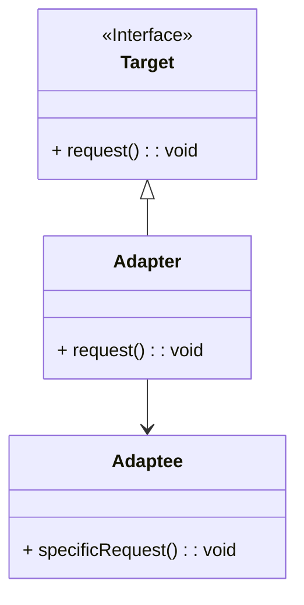
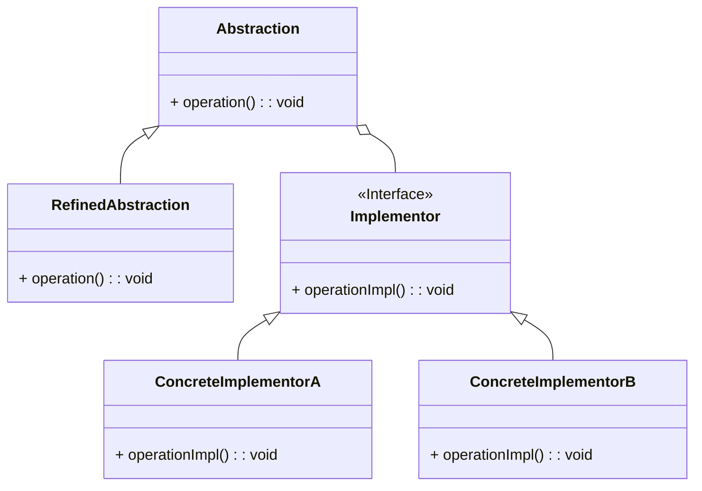
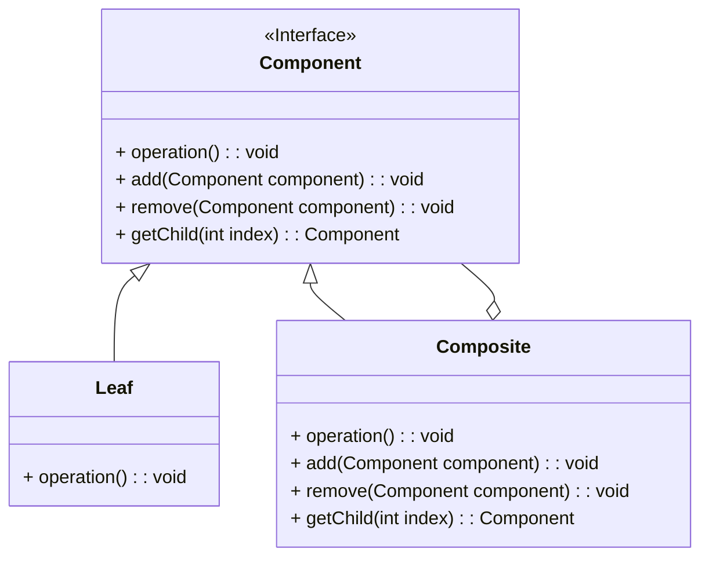

## Adapter Pattern

The Adapter Pattern is a structural design pattern that allows objects with incompatible interfaces to work together. It acts as a bridge between two incompatible interfaces by providing a way to convert one interface into another that a client expects. This pattern is particularly useful when integrating legacy systems with new systems, or when you want to use a class that has an incompatible interface.

Here's the Mermaid diagram for the Adapter pattern:



### Explanation

- **Target Interface:** Defines the domain-specific interface that the client uses.
- **Adaptee Class:** Contains some useful behavior but has an incompatible interface.
- **Adapter Class:** Implements the `Target` interface and translates the requests from the `Target` interface into calls to the `Adaptee` class.

### Benefits of the Adapter Pattern:
1. **Reusability:** Allows existing functionality to be reused where otherwise it would be incompatible.
2. **Decoupling:** Decouples the client code from the implementations of the `Adaptee` class.
3. **Flexibility:** Makes it easier to extend or replace functionalities without modifying existing code.

### Implementation Example in Java

Here's a simple implementation example of the Adapter pattern in Java:

```java
// Target interface
interface Target {
    void request();
}

// Adaptee class
class Adaptee {
    public void specificRequest() {
        System.out.println("Adaptee specific request");
    }
}

// Adapter class
class Adapter implements Target {
    private Adaptee adaptee;

    public Adapter(Adaptee adaptee) {
        this.adaptee = adaptee;
    }

    public void request() {
        adaptee.specificRequest();
    }
}

// Client code
public class Main {
    public static void main(String[] args) {
        Adaptee adaptee = new Adaptee();
        Target adapter = new Adapter(adaptee);
        adapter.request();
    }
}
```

In this example:
- The `Target` interface defines the method `request` that the client expects.
- The `Adaptee` class has a method `specificRequest` with different behavior.
- The `Adapter` class implements the `Target` interface and uses an instance of `Adaptee` to fulfill the request by calling `specificRequest`.

The client code creates an instance of `Adaptee` and an instance of `Adapter` that makes the `Adaptee` compatible with the `Target` interface.

## Bridge Pattern

The Bridge Pattern is a structural design pattern that separates the abstraction from its implementation, allowing them to vary independently. This pattern is particularly useful when you want to avoid a permanent binding between an abstraction and its implementation, or when both the abstraction and its implementation should be extensible by subclassing.

Here's the Mermaid diagram for the Bridge pattern:



### Explanation

- **Abstraction:** Defines the abstract interface and maintains a reference to an object of type `Implementor`.
- **RefinedAbstraction:** Extends the `Abstraction` and implements the `operation` method by using methods from `Implementor`.
- **Implementor Interface:** Declares the interface for implementation classes that provide concrete implementations.
- **ConcreteImplementorA and ConcreteImplementorB:** Implement the `Implementor` interface and provide specific implementations for the `operationImpl` method.

### Benefits of the Bridge Pattern:
1. **Decoupling Abstraction and Implementation:** Allows the abstraction and its implementation to vary independently.
2. **Improved Extensibility:** Makes it easier to extend the abstraction and the implementation independently.
3. **Enhanced Flexibility:** Reduces the need to modify code when adding new abstractions or implementations.

### Implementation Example in Java

Here's a simple implementation example of the Bridge pattern in Java:

```java
// Implementor interface
interface Implementor {
    void operationImpl();
}

// ConcreteImplementorA class
class ConcreteImplementorA implements Implementor {
    public void operationImpl() {
        System.out.println("ConcreteImplementorA operation");
    }
}

// ConcreteImplementorB class
class ConcreteImplementorB implements Implementor {
    public void operationImpl() {
        System.out.println("ConcreteImplementorB operation");
    }
}

// Abstraction class
abstract class Abstraction {
    protected Implementor implementor;

    protected Abstraction(Implementor implementor) {
        this.implementor = implementor;
    }

    public abstract void operation();
}

// RefinedAbstraction class
class RefinedAbstraction extends Abstraction {
    public RefinedAbstraction(Implementor implementor) {
        super(implementor);
    }

    public void operation() {
        implementor.operationImpl();
    }
}

// Client code
public class Main {
    public static void main(String[] args) {
        Implementor implementorA = new ConcreteImplementorA();
        Abstraction abstractionA = new RefinedAbstraction(implementorA);
        abstractionA.operation();

        Implementor implementorB = new ConcreteImplementorB();
        Abstraction abstractionB = new RefinedAbstraction(implementorB);
        abstractionB.operation();
    }
}
```

In this example:
- The `Implementor` interface defines the method `operationImpl` that concrete implementors will provide.
- `ConcreteImplementorA` and `ConcreteImplementorB` provide specific implementations of `operationImpl`.
- The `Abstraction` class maintains a reference to an `Implementor` and defines the abstract `operation` method.
- `RefinedAbstraction` extends `Abstraction` and implements the `operation` method by calling the `operationImpl` method of the `Implementor`.

The client code creates different combinations of abstractions and implementors, demonstrating how they can vary independently.

## Composite Pattern

The Composite Pattern is a structural design pattern that allows you to compose objects into tree structures to represent part-whole hierarchies. This pattern lets clients treat individual objects and compositions of objects uniformly. It is particularly useful when dealing with tree-like structures such as file systems, organizational hierarchies, or UI components.

Here's the Mermaid diagram for the Composite pattern:



### Explanation

- **Component Interface:** Declares common operations for both `Leaf` and `Composite` objects, such as `operation`, `add`, `remove`, and `getChild`.
- **Leaf Class:** Represents individual objects in the composition. Implements the `Component` interface but does not support adding or removing components.
- **Composite Class:** Represents a composite component that can have children. Implements the `Component` interface and defines behavior for adding, removing, and accessing child components.

### Benefits of the Composite Pattern:
1. **Uniformity:** Treats individual objects and compositions of objects uniformly.
2. **Flexibility:** Makes it easy to add new kinds of components without changing existing code.
3. **Simplified Client Code:** Clients can interact with complex tree structures through a simple interface.

### Implementation Example in Java

Here's a simple implementation example of the Composite pattern in Java:

```java
// Component interface
interface Component {
    void operation();
    default void add(Component component) {
        throw new UnsupportedOperationException();
    }
    default void remove(Component component) {
        throw new UnsupportedOperationException();
    }
    default Component getChild(int index) {
        throw new UnsupportedOperationException();
    }
}

// Leaf class
class Leaf implements Component {
    private String name;

    public Leaf(String name) {
        this.name = name;
    }

    public void operation() {
        System.out.println("Leaf " + name + " operation");
    }
}

// Composite class
class Composite implements Component {
    private List<Component> children = new ArrayList<>();

    public void operation() {
        for (Component child : children) {
            child.operation();
        }
    }

    public void add(Component component) {
        children.add(component);
    }

    public void remove(Component component) {
        children.remove(component);
    }

    public Component getChild(int index) {
        return children.get(index);
    }
}

// Client code
public class Main {
    public static void main(String[] args) {
        Component leaf1 = new Leaf("1");
        Component leaf2 = new Leaf("2");
        
        Composite composite = new Composite();
        composite.add(leaf1);
        composite.add(leaf2);

        Component leaf3 = new Leaf("3");
        Composite composite2 = new Composite();
        composite2.add(composite);
        composite2.add(leaf3);

        composite2.operation();
    }
}
```

In this example:
- The `Component` interface defines common operations for both leaf and composite objects.
- The `Leaf` class represents individual objects and implements the `Component` interface.
- The `Composite` class can have children and implements the `Component` interface to provide behavior for adding, removing, and accessing child components.

The client code demonstrates creating a composite structure and performing operations on it, treating both individual `Leaf` objects and `Composite` objects uniformly.
