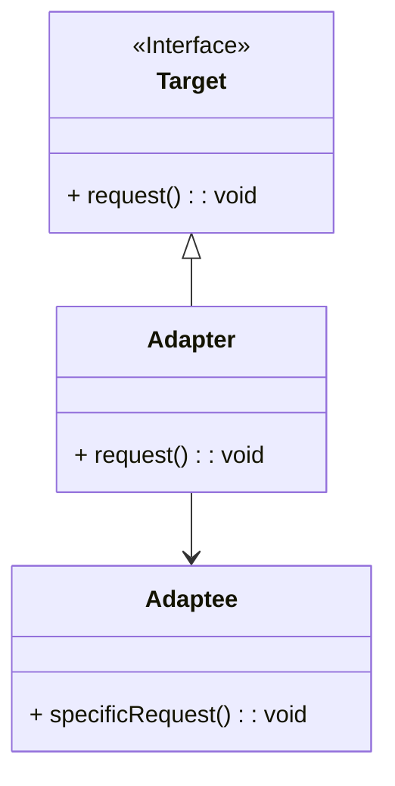
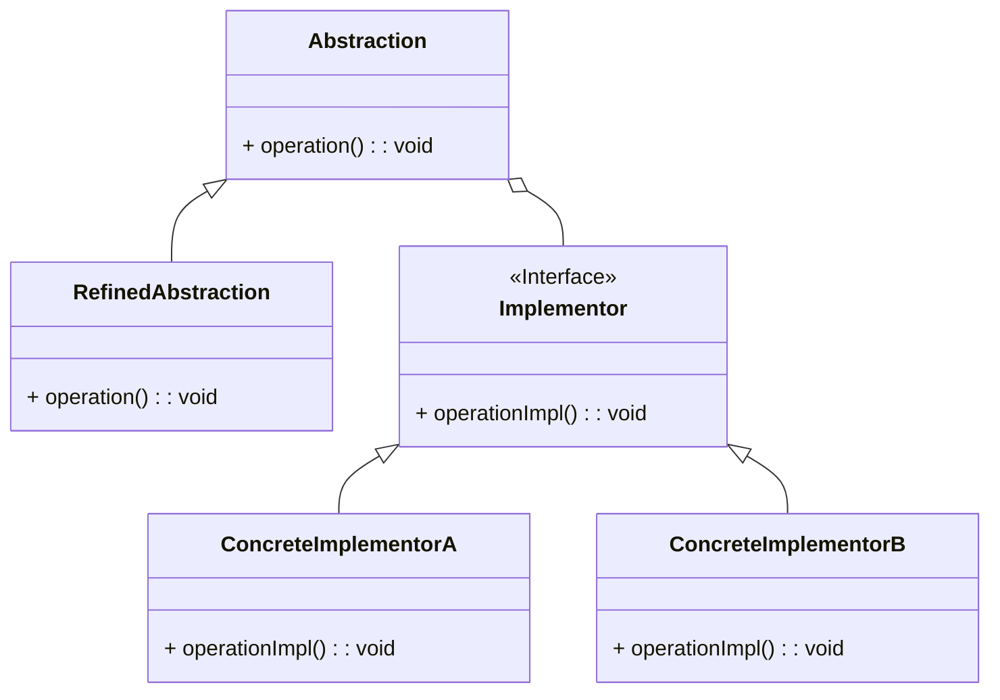

## Adapter Pattern

The Adapter Pattern is a structural design pattern that allows objects with incompatible interfaces to work together. It acts as a bridge between two incompatible interfaces by providing a way to convert one interface into another that a client expects. This pattern is particularly useful when integrating legacy systems with new systems, or when you want to use a class that has an incompatible interface.

Here's the Mermaid diagram for the Adapter pattern:



### Explanation

- **Target Interface:** Defines the domain-specific interface that the client uses.
- **Adaptee Class:** Contains some useful behavior but has an incompatible interface.
- **Adapter Class:** Implements the `Target` interface and translates the requests from the `Target` interface into calls to the `Adaptee` class.

### Benefits of the Adapter Pattern:
1. **Reusability:** Allows existing functionality to be reused where otherwise it would be incompatible.
2. **Decoupling:** Decouples the client code from the implementations of the `Adaptee` class.
3. **Flexibility:** Makes it easier to extend or replace functionalities without modifying existing code.

### Implementation Example in Java

Here's a simple implementation example of the Adapter pattern in Java:

```java
// Target interface
interface Target {
    void request();
}

// Adaptee class
class Adaptee {
    public void specificRequest() {
        System.out.println("Adaptee specific request");
    }
}

// Adapter class
class Adapter implements Target {
    private Adaptee adaptee;

    public Adapter(Adaptee adaptee) {
        this.adaptee = adaptee;
    }

    public void request() {
        adaptee.specificRequest();
    }
}

// Client code
public class Main {
    public static void main(String[] args) {
        Adaptee adaptee = new Adaptee();
        Target adapter = new Adapter(adaptee);
        adapter.request();
    }
}
```

In this example:
- The `Target` interface defines the method `request` that the client expects.
- The `Adaptee` class has a method `specificRequest` with different behavior.
- The `Adapter` class implements the `Target` interface and uses an instance of `Adaptee` to fulfill the request by calling `specificRequest`.

The client code creates an instance of `Adaptee` and an instance of `Adapter` that makes the `Adaptee` compatible with the `Target` interface.

## Bridge Pattern

The Bridge Pattern is a structural design pattern that separates the abstraction from its implementation, allowing them to vary independently. This pattern is particularly useful when you want to avoid a permanent binding between an abstraction and its implementation, or when both the abstraction and its implementation should be extensible by subclassing.

Here's the Mermaid diagram for the Bridge pattern:



### Explanation

- **Abstraction:** Defines the abstract interface and maintains a reference to an object of type `Implementor`.
- **RefinedAbstraction:** Extends the `Abstraction` and implements the `operation` method by using methods from `Implementor`.
- **Implementor Interface:** Declares the interface for implementation classes that provide concrete implementations.
- **ConcreteImplementorA and ConcreteImplementorB:** Implement the `Implementor` interface and provide specific implementations for the `operationImpl` method.

### Benefits of the Bridge Pattern:
1. **Decoupling Abstraction and Implementation:** Allows the abstraction and its implementation to vary independently.
2. **Improved Extensibility:** Makes it easier to extend the abstraction and the implementation independently.
3. **Enhanced Flexibility:** Reduces the need to modify code when adding new abstractions or implementations.

### Implementation Example in Java

Here's a simple implementation example of the Bridge pattern in Java:

```java
// Implementor interface
interface Implementor {
    void operationImpl();
}

// ConcreteImplementorA class
class ConcreteImplementorA implements Implementor {
    public void operationImpl() {
        System.out.println("ConcreteImplementorA operation");
    }
}

// ConcreteImplementorB class
class ConcreteImplementorB implements Implementor {
    public void operationImpl() {
        System.out.println("ConcreteImplementorB operation");
    }
}

// Abstraction class
abstract class Abstraction {
    protected Implementor implementor;

    protected Abstraction(Implementor implementor) {
        this.implementor = implementor;
    }

    public abstract void operation();
}

// RefinedAbstraction class
class RefinedAbstraction extends Abstraction {
    public RefinedAbstraction(Implementor implementor) {
        super(implementor);
    }

    public void operation() {
        implementor.operationImpl();
    }
}

// Client code
public class Main {
    public static void main(String[] args) {
        Implementor implementorA = new ConcreteImplementorA();
        Abstraction abstractionA = new RefinedAbstraction(implementorA);
        abstractionA.operation();

        Implementor implementorB = new ConcreteImplementorB();
        Abstraction abstractionB = new RefinedAbstraction(implementorB);
        abstractionB.operation();
    }
}
```

In this example:
- The `Implementor` interface defines the method `operationImpl` that concrete implementors will provide.
- `ConcreteImplementorA` and `ConcreteImplementorB` provide specific implementations of `operationImpl`.
- The `Abstraction` class maintains a reference to an `Implementor` and defines the abstract `operation` method.
- `RefinedAbstraction` extends `Abstraction` and implements the `operation` method by calling the `operationImpl` method of the `Implementor`.

The client code creates different combinations of abstractions and implementors, demonstrating how they can vary independently.
